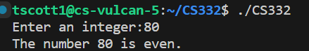
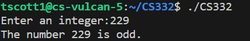

# Compilation Instructions

If using GCC, use the following command in the terminal:
```bash
gcc -o CS332 lab1.c # This will compile the filename and return an executable with the executable name.

gcc -o lab1 lab1.c # This will compile lab1.c and output an executable called lab1.

```
To execute the compiled program in the terminal use the following command:
```bash
./lab1
 ```

# My Files
## lab1.c

### main()
This function returns whether an integer is even or odd.

This function uses scanf to read the integer value. If the number is divisble by 2, the fuction prints that the number is even. Otherwise, the fucntion prints that the integer is odd.


# Output screenshots




# Github Repository
https://github.com/tatyanamk/lab1

# References
https://www.geeksforgeeks.org/check-whether-given-number-even-odd/


