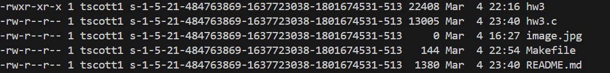

# Compilation Instructions

```bash
make # This will compile all the files
```

 # Commands 
 ./hw3 -L 1024 -e "ls -l" : This command lists all files with size >= 1024 bytes in the current
directory, and execute the command "ls -l" on each file
(ignore directories).

./hw3 -L 1024 -s jpg 3 -e "wc -l" : This command lista all files that have the substring “jpg” in their filename
with depth <=3 relative to the current directory and size >= 1024, and execute the command "wc -l" on each file
(ignore directories). 


# My Files

## hw3.c

### main()

This function initializes variables for parsing the command-line arguments. The function iterates through arguments to enter the currentCommand structure, setting the flags. This function initializes the currentCommand structure.

### execute_command
This function calls fork, which creates a child process. The child process is replaced with the provided command using execlp.

### doChecks
This function declares several functions, specifying their names and type signature. These functions perform tasks such as parsing command-line arguments, printing file information, performing file searches, etc. 

### getE
This function ensure thateach file that matches the search criteria the UNIX command specified with arguments will be executed.

# Output screenshots



# Github Repository
https://github.com/tatyanamk/CS332

