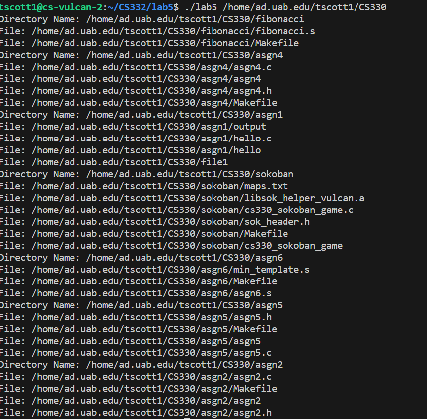

# Compilation Instructions


```bash
gcc -o gcc -o CS332 lab5.c # this will compile the filename and return an executable with the executable name

gcc -o lab5 lab5.c # this will compile gettime.c and output an executable called gettime
```
```
To execute the compiled program in the terminal use the following command:
```bash
./lab5 <directory_path>
 ```
# My Files

## traverseDir()
This function traverses the file hierarchy recursively and list all the sub directories and the files in these sub directories.
The function takes the directory name (dirname) as an argument. It opens the directory using opendir. If the directory is unable to be opened, it prints an error message and returns.
Next, it enters a loop to read each item in the directory using readdir. For each entry it skips items for the current and parent directory and prints the path of the entry.
If the entry is a directory it provides the full path of the subdirectory and recursively calls traverseDir with the path.

### main()

This function checks if the number of arguments is not equal to 2, which would indicate that there's no directory name provided as an argument. If the number of arguments is not equal to two, it prints the correct usage of the program and exits. Otherwise, it calls the traverseDir function. 


# Output screenshots

# Github Repository
https://github.com/tatyanamk/CS332


