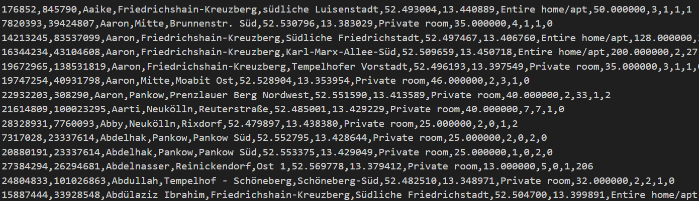
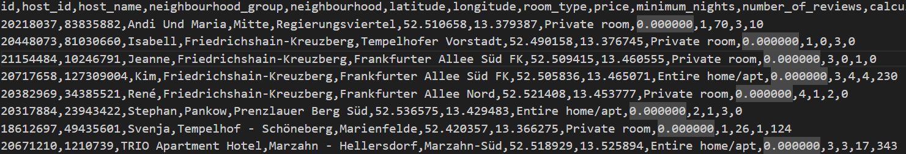

# Compilation Instructions

If using GCC, use the following command in the terminal:
```bash
gcc -o CS332 lab6.c # This will compile the filename and return an executable with the executable name.

gcc -o lab6 lab6.c # This will compile lab1.c and output an executable called lab6.

```
To execute the compiled program in the terminal use the following command:
```bash
./lab6
 ```

# My Files
## lab6.c

### main()
The main function opens the input CSV file "listings.csv" to read it. If the file is empty, an error is printed and the program exits. The function reads data from the CSV file using fgets, parses each line using getfields, and stores the parsed listing structs in the list_items array. The input file ise closed once it is read.  

### host_name_comparison
This function sorts the listing structs by the host's name.

### price_comparison
This function sorts the listing structs by price.

# Output Screenshots



# Github Repository
https://github.com/tatyanamk/CS332

# References
Lab Workbook


